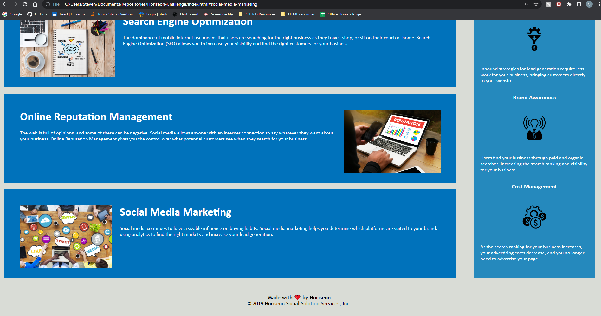

Horiseon rework challenge

changed some unnecessary pixels on the web page to better align with the structure. 

added h4 to the footer for better design choice

started inital recoding of the Horiseon website, replaced all div tags with more intuitive tags, including the section tag and article tag.

reworked the css. consolidated tags from specific instances to singular classes

removed the "p" class. could not find any issues or changes after it was removed. could be an issue on my end if substantial changes are apparent. 

https://github.com/StevenBolc/Horiseon-Challenge

https://stevenbolc.github.io/Horiseon-Challenge/

